# Tarea 1 - Instalación en VPS de un CMS
 
## Autor

- Anxo Vázquez Lorenzo (2 DAM)

## Asignatura

- SXE

## 1. El servidor

### Antes de comenzar

| Elemento | Lo que dice la documentación | Lo que necesita la VM | Comentarios | Fuente |
| --- | --- | --- | --- | --- |
| S.O. | No especifica | Sistema sin entorno gráfico | Usaré Debian por su estabilidad, ligereza | [Documentación oficial de wordpress](https://wordpress.org/about/requirements/) |
| Servidor WEB | Apache o Nginx | Apache o Nginx | Usaré Apache porque es el más usado en tutoriales | [Documentación oficial de wordpress](https://wordpress.org/about/requirements/) |
| Versión de PHP | 8.3 o superior | 8.3 o superior | Se usará 8.4.24, que es la últimna versión estable que se instala por defecto con apt en debian13| [Documentación oficial de wordpress](https://wordpress.org/about/requirements/) |
| Gestor de BBDD | Mysql 8.0 o MariaDB 10.11 (o superiores) | Mysql 8.0 o MariaDB 10.11 | Usaré mariadb ya que es más común de encontrarlo junto a wordpress | [Documentación oficial de wordpress](https://wordpress.org/about/requirements/) |
| Memoria y Disco | Non especificados | RAM 2 GB (sistema) + 1 GB (Nginx + mysql) + 1 GB (Libre) = 4 GB<br><br>Disco 20 GB (Sistema) + 5 GB (Mysql, Wordpress, Nginx) + 5 GB (Libres) = 30 GB | Usaré 4 GB de RAM y 30GB de disco dando así un poco de espacio extra. | [Documentación oficial de wordpress](https://wordpress.org/about/requirements/) |

### Configurando la VM

#### Instalación del sistema

Descargo la iso de `Debian 13` desde la web oficial (concretamente la versión "full" no la "netInstall") y creo una máquina virtual con 4GB de RAM, 30GB de disco y 2 procesadores.

Después de arrancarla empiezo la instalación y en `Selección de programas` indico que se instale sin escritorio, con servidor `SSH` (me ahorrará la instalación en un futuro) y `Utilidades estándar del sistema`.

> El resto de la instalación son cosas básicas como usuario, contraseña, disco, red, etc

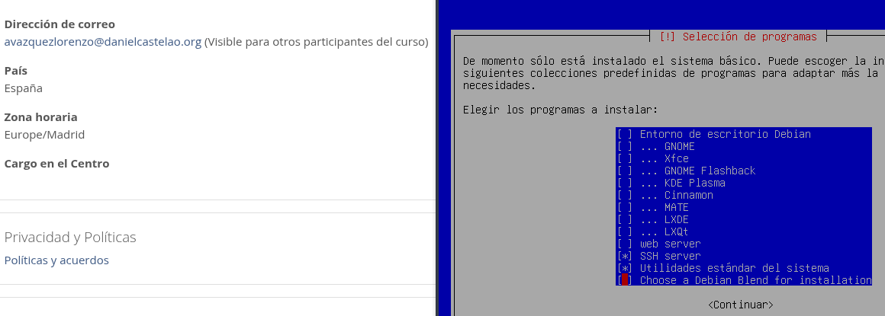

Una vez finalizada la instalación actualizo el sistema y preparo mi usuario `anxo` para que pueda usar sudo.

```
#Para actualizar el sistema
sudo apt update && sudo apt upgrade -y
```

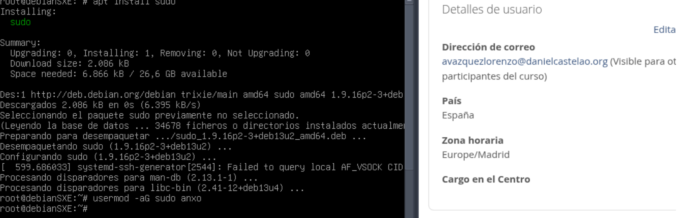

Al terminar cierro sesión con mi usuario para que así sea efectivo el comando `usermod`.

A partir de este punto sigo por `ssh` desde mi equipo.

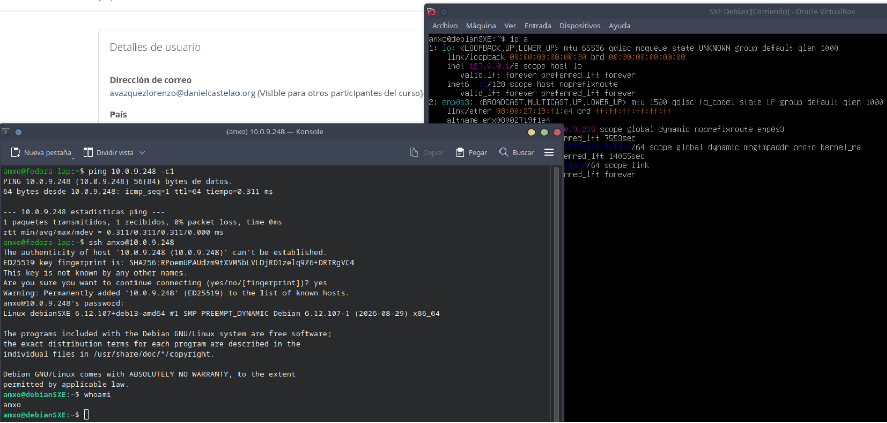

## 2. La instalación

### `Apache` y `MariaDB`

Guiandome de los tutoriales de la `Bibliografía` (al final de este `README`) empiezo instalando `apache` y `mariadb`.

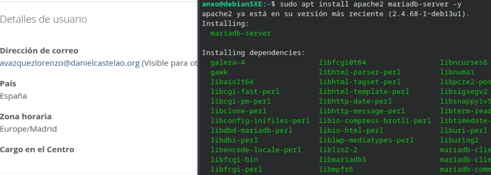

Ejecuto el siguiente script para asegurar la instalación de `mariadb`.

```
sudo mysql_secure_installation
```

Mi selección:

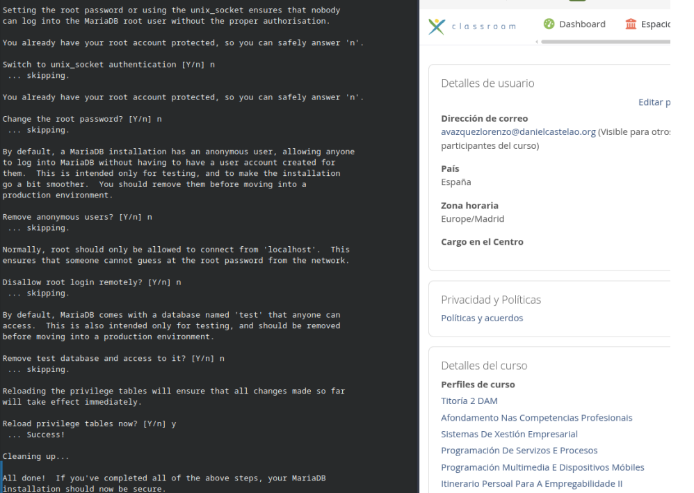

### `PHP`

Instalo `php` con el siguiente comando:

```
sudo apt install php libapache2-mod-php php-mysql php-curl php-gd php-mbstring php-xml php-xmlrpc php-soap php-intl php-zip -y
```

### `Crear la base de datos`

Creo a `base de datos` y el usuario con el que `wordpress` accederá a ella.

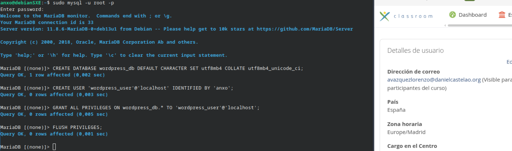

### Configuraciones de `Apache` y descarga de `Wordpress`

Activo un módulo necesario para que `apache` pueda reescribir e interceptar `URLS` en tiempo real

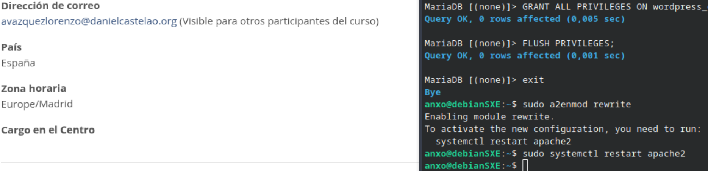

Descargo `wordpress` con `wget`, creo la carpeta contenedora, descomprimo el archivo y cambio sus permisos.

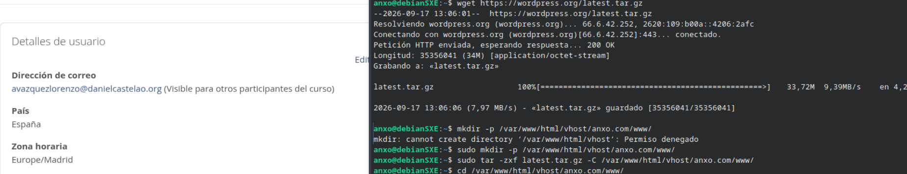

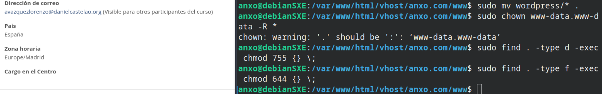

Creo el siguiente archivo de configuración de `apache` que indica la ruta raíz del sitio y su nombre de `dominio`.

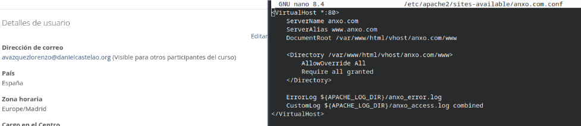

Habilito el nuevo sitio (`anxo.com`) y deshabilito el `default`, despues reinicio el servicio de `apache`:

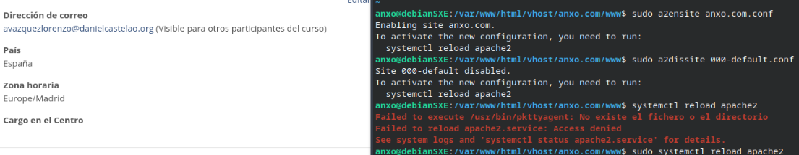

Ahora en mi equipo accedo al archivo `hosts` y agrego una línea que indica que el `dominio` nuevo apunte al servidor.

```
echo "10.0.9.248 anxo.com" >> /etc/hosts
```

## Prueba de funcionamiento

En mi navegador web accedo a `anxo.com/wp-admin/setup-config.php` y comienzo la instalación.

En la siguiente captura se muestra como configuro `wordpress` para acceder a la `base de datos`.

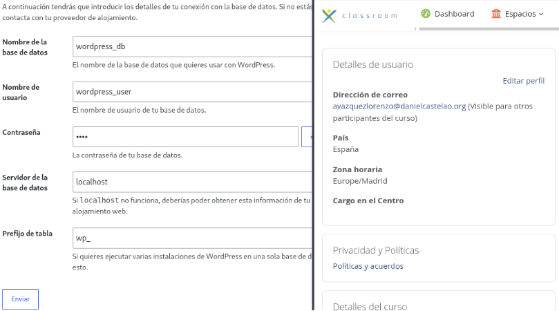

Creo el sitio de `wordpress`:

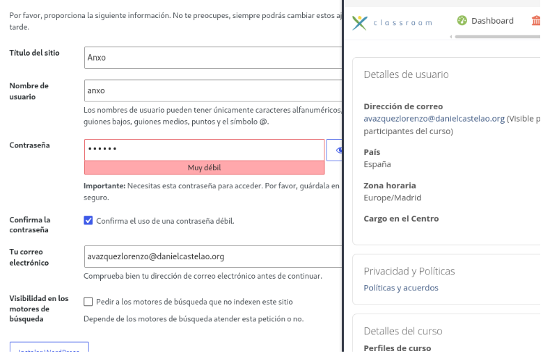

Modifico la página de ejemplo para que muestre mi nombre:

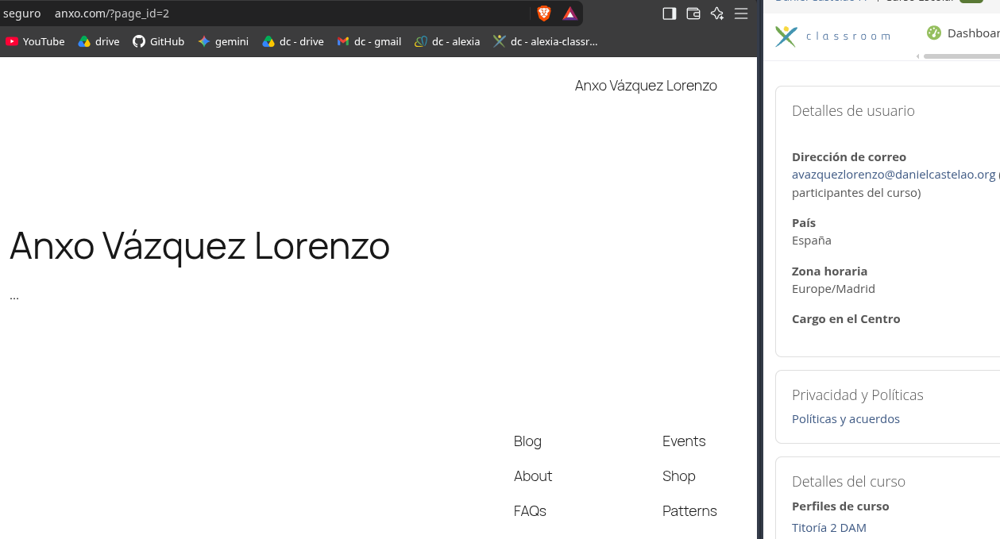

## Problemas encontrados

### `apt`

Recién instalado `debian` no podía instalar nada con `apt` (`update`, `install`, etc) porque los repositorios eran incorrectos, así que agregué los siguientes. 

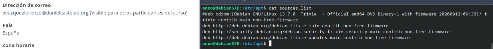

Una vez con los nuevos repositorios procedí a ejecutar `apt update` y ahora si que estaba listo para instalar los paquetes necesarios.

### Tutoriales

Al terminar con el tutorial de Voidnull no crea el archivo ‘/etc/apache2/sites-available/anxo.com.conf’ ni activa los sitios para que apache funcione, para ello me fijo de me fijo en el tutorial de Debian Wiki.

> Consulta la bibliografía para ver los tutoriales

### Instalación de `wordpress`

Una vez con el `wordpress` descargado y con todo funcionando, usando el navegador para finalizar la instalación me muestra el siguiente mensaje:

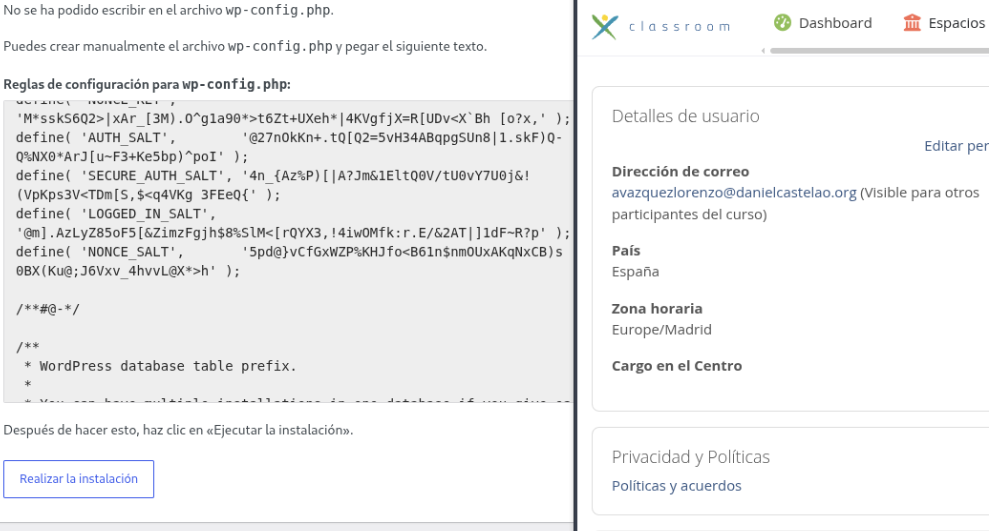

Para solucionarlo simplemente creo ese archivo con el contenido indicado, vuelvo a intentarlo y ya me deja completar la instalación

## Bibliografía

- Gemini - Ayuda con repositorios apt

    Prompt: Cuales son los repositorios oficiales de debian 13 de apt?

    https://gemini.google.com/

- Puntocomunica - Dar permisos a mi usuario para usar sudo

    https://foro.puntocomunica.com/viewtopic.php?t=424

- Wordpress - Documentación oficial

    https://wordpress.org/documentation/

- Voidnull - Instalación wordpress

    https://voidnull.es/instalacion-de-wordpress-en-debian-13/

- Debian Wiki - Apoyo para instalación de Wordpress 

    https://wiki.debian.org/WordPress 
